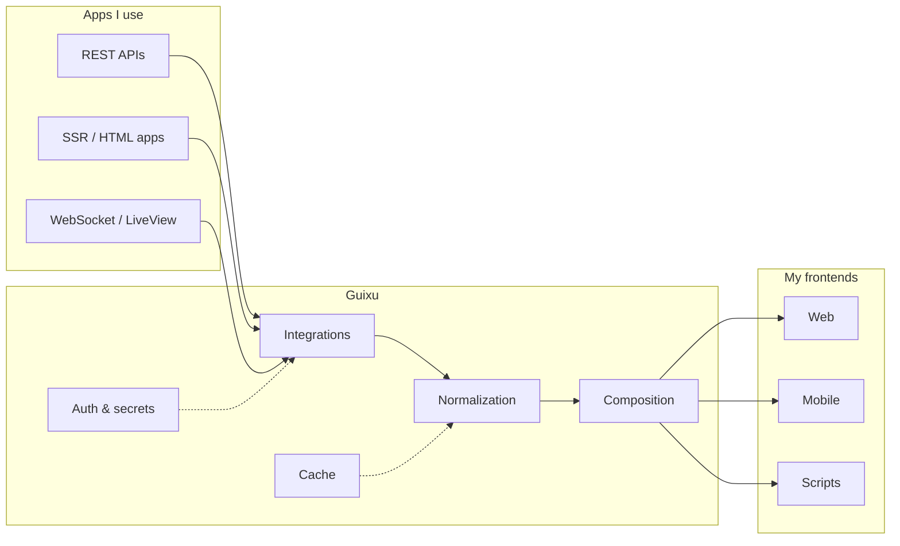

# Guixu

**My private backend — where the APIs and data from the apps I use converge, normalize, and re-emerge as clean interfaces for the frontends I build.**

[Overview](#overview) • [How it works](#how-it-works) • [Capabilities](#capabilities) • [Why it's on GitHub](#why-its-on-github) • [Project status](#project-status)

---

## Overview

**Guixu** (归墟) is **my** personal integration backend. I use many apps — finance tools, productivity services, custom utilities — and each speaks its own protocol, auth model, and data shape. I built Guixu so **my** frontends never have to deal with any of that directly.

In Chinese mythology, *Guixu* is not an ordinary pool. It receives every stream. This project works the same way: external app APIs, data, and capabilities flow into one private backend, get **encapsulated**, **normalized**, **authenticated**, **cached**, and **composed**, then surface again through APIs I control.

```
  Apps I use                   Guixu                         My frontends
 ┌──────────────┐         ┌──────────────┐              ┌──────────────┐
 │ Finance apps │──┐      │              │              │  Dashboard   │
 │ Productivity │──┼─────▶│  Encapsulate │─────────────▶│  Mobile app  │
 │ Other tools  │──┘      │  Normalize   │              │  Scripts     │
 └──────────────┘         │  Auth/Cache  │              └──────────────┘
                          │  Compose     │
                          └──────────────┘
```

> [!NOTE]
> Guixu is **not** a service I run for others. It is infrastructure I run for myself. Credentials, session material, and upstream integration details stay on my server; my frontends talk only to Guixu's API.

## How it works

Third-party services rarely share a common shape. Some expose REST JSON; others return server-rendered HTML; many require cookie-based sessions, CSRF tokens, or provider-specific auth flows. I don't want that complexity in my UI code.

Guixu sits in the middle and owns the messy parts:

1. **Ingest** — Connect to upstream apps using whatever auth each one requires.
2. **Transform** — Parse, scrape, or map upstream responses into stable internal models.
3. **Serve** — Expose a small, consistent API that my frontends can depend on.



## Capabilities

| Concern | What Guixu does for me |
| --- | --- |
| **Encapsulation** | Hides upstream URLs, headers, cookies, and protocol quirks behind integration modules. |
| **Normalization** | Maps heterogeneous payloads into predictable schemas my frontends can consume. |
| **Authentication** | Centralizes secrets and session handling so my clients never hold upstream credentials. |
| **Caching** | Cuts upstream load and latency for expensive or rate-limited reads. |
| **Composition** | Joins data from multiple apps into higher-level endpoints — e.g. a unified dashboard view. |

> [!IMPORTANT]
> Guixu is **not** a transparent forward proxy. Every integration is intentional: shaped, validated, and maintained as part of my private API surface.

## Why it's on GitHub

This repo is public, but **serving other people is not why I built it**. I open-sourced it because the problem is common — many developers run their own stack of apps and wish they had one private layer underneath — and the approach might be useful to someone with a similar setup.

If you fork or borrow from this project, treat it as a reference implementation of that pattern, not as a hosted product or a framework I'm maintaining for adopters. You'll need your own upstream accounts, credentials, and deployment.

## Project status

Early development. The first Rust API surface is being built around Youzhiyouxing (有知有行), a finance dashboard backed by Phoenix LiveView rather than a clean JSON API. Research notes live in [`reference/youzhiyouxing/yx-dashboard-data-source-summary.md`](reference/youzhiyouxing/yx-dashboard-data-source-summary.md).

Planned layout as the project grows:

```text
guixu/
├── integrations/     # Per-app upstream connectors
├── api/              # HTTP surface for my frontends
├── models/           # Normalized domain types
├── cache/
└── config/           # Secrets & environment (never committed)
```

> [!WARNING]
> Never commit upstream session cookies, API keys, or other secrets — whether this is your fork or mine.

## Design principles

- **Built for me first** — Every integration exists because I need it in my own apps.
- **One backend, many frontends** — Wrap an app once; reuse it across everything I build.
- **Stable contracts** — My frontends depend on Guixu's schemas, not on upstream churn.
- **Server-side trust boundary** — All sensitive auth material stays off the client.
- **Incremental** — Add apps one at a time; compose them as patterns emerge.

---

*Guixu receives the streams. My frontends get the surface.*
